# InvoiceFlow - Technische Dokumentation

## Inhaltsverzeichnis

1. [Projektübersicht](#1-projektübersicht)
2. [Technologie-Stack](#2-technologie-stack)
3. [Systemarchitektur](#3-systemarchitektur)
4. [Datenbankdesign](#4-datenbankdesign)
5. [Authentifizierung & Sicherheit](#5-authentifizierung--sicherheit)
6. [Anwendungsstruktur](#6-anwendungsstruktur)
7. [ZUGFeRD E-Rechnung](#7-zugferd-e-rechnung)
8. [E-Mail-System](#8-e-mail-system)
9. [Datenfluss-Diagramme](#9-datenfluss-diagramme)
10. [Komponentenarchitektur](#10-komponentenarchitektur)
11. [Validierung & Fehlerbehandlung](#11-validierung--fehlerbehandlung)
12. [Testing-Strategie](#12-testing-strategie)
13. [Externe Services](#13-externe-services)
14. [Deployment](#14-deployment)

---

## 1. Projektübersicht

**InvoiceFlow** ist eine deutschsprachige Rechnungsverwaltungsanwendung für Freelancer. Die Anwendung ermöglicht die schnelle Erstellung professioneller Rechnungen mit ZUGFeRD-Konformität (deutscher E-Rechnungsstandard).

### Kernfunktionen

- **Kundenverwaltung**: CRUD-Operationen für Kundenstammdaten
- **Rechnungserstellung**: Schnelle Rechnungserstellung mit automatischer Nummerierung
- **ZUGFeRD-Export**: PDF/A-3 konforme Rechnungen mit eingebettetem XML
- **E-Mail-Versand**: Direkter Versand von Rechnungen an Kunden
- **Dashboard**: Übersicht über Umsätze und offene Rechnungen

### Zielgruppe

Freelancer und Selbstständige im deutschsprachigen Raum, die eine einfache und rechtskonforme Rechnungslösung benötigen.

---

## 2. Technologie-Stack

### Übersicht

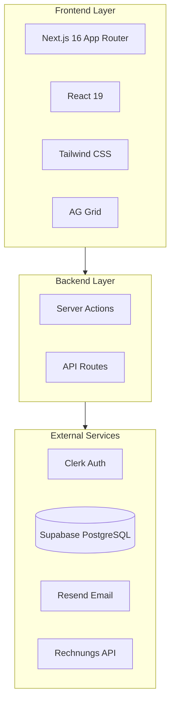
```mermaid
graph TB
    subgraph Frontend["Frontend Layer"]
        Next[Next.js 16 App Router]
        React[React 19]
        TW[Tailwind CSS]
        AG[AG Grid]
    end

    subgraph Backend["Backend Layer"]
        SA[Server Actions]
        API[API Routes]
    end

    subgraph Services["External Services"]
        Clerk[Clerk Auth]
        Supabase[(Supabase PostgreSQL)]
        Resend[Resend Email]
        RAPI[Rechnungs API]
    end

    Frontend --> Backend
    Backend --> Services
```

### Detaillierte Technologie-Matrix

| Kategorie | Technologie | Version | Zweck |
|-----------|-------------|---------|-------|
| **Framework** | Next.js | 16.0.8 | Full-Stack React Framework |
| **UI Library** | React | 19.0.0 | Komponentenbasierte UI |
| **Styling** | Tailwind CSS | 3.4.1 | Utility-First CSS |
| **Authentifizierung** | Clerk | 6.36.1 | User Management |
| **Datenbank** | Supabase | 2.87.1 | PostgreSQL + RLS |
| **Formulare** | React Hook Form | 7.68.0 | Form State Management |
| **Validierung** | Zod | 4.1.13 | Schema Validation |
| **Tabellen** | AG Grid | 34.3.1 | Advanced Data Grid |
| **PDF** | @react-pdf/renderer | 4.3.1 | PDF-Generierung |
| **E-Rechnung** | @rechnungs-api/client | 0.1.6 | ZUGFeRD-Konformität |
| **E-Mail** | Resend | 6.7.0 | Transaktionale E-Mails |
| **Datum** | date-fns | 4.1.0 | Datumsformatierung |
| **Testing** | Vitest + Playwright | 4.0.15 / 1.57.0 | Unit + E2E Tests |

---

## 3. Systemarchitektur

### High-Level Architektur

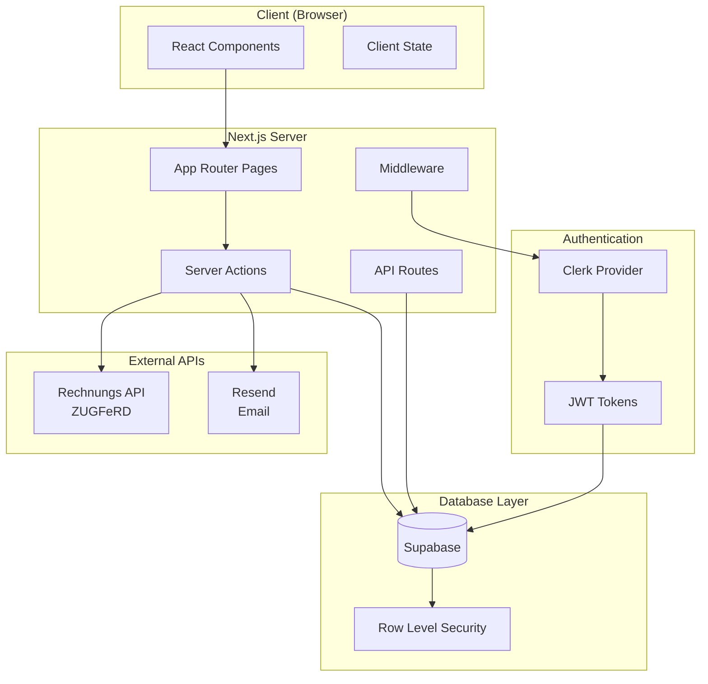
```mermaid
graph TB
    subgraph Client["Client (Browser)"]
        UI[React Components]
        State[Client State]
    end

    subgraph NextJS["Next.js Server"]
        Pages[App Router Pages]
        Actions[Server Actions]
        Routes[API Routes]
        MW[Middleware]
    end

    subgraph Auth["Authentication"]
        ClerkP[Clerk Provider]
        JWT[JWT Tokens]
    end

    subgraph Database["Database Layer"]
        SB[(Supabase)]
        RLS[Row Level Security]
    end

    subgraph External["External APIs"]
        RAPI[Rechnungs API<br/>ZUGFeRD]
        RS[Resend<br/>Email]
    end

    UI --> Pages
    Pages --> Actions
    Actions --> SB
    Actions --> RAPI
    Actions --> RS
    Routes --> SB
    MW --> ClerkP
    ClerkP --> JWT
    JWT --> SB
    SB --> RLS
```

### Schichtenarchitektur

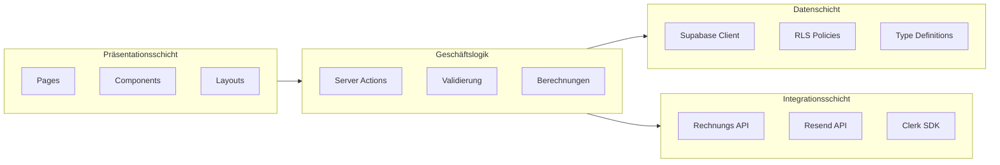
```mermaid
graph LR
    subgraph Presentation["Präsentationsschicht"]
        P1[Pages]
        P2[Components]
        P3[Layouts]
    end

    subgraph Business["Geschäftslogik"]
        B1[Server Actions]
        B2[Validierung]
        B3[Berechnungen]
    end

    subgraph Data["Datenschicht"]
        D1[Supabase Client]
        D2[RLS Policies]
        D3[Type Definitions]
    end

    subgraph Integration["Integrationsschicht"]
        I1[Rechnungs API]
        I2[Resend API]
        I3[Clerk SDK]
    end

    Presentation --> Business
    Business --> Data
    Business --> Integration
```

---

## 4. Datenbankdesign

### Entity-Relationship-Diagramm

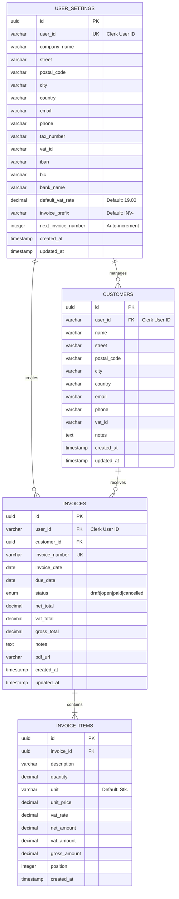
```mermaid
erDiagram
    USER_SETTINGS ||--o{ INVOICES : "creates"
    USER_SETTINGS ||--o{ CUSTOMERS : "manages"
    CUSTOMERS ||--o{ INVOICES : "receives"
    INVOICES ||--|{ INVOICE_ITEMS : "contains"

    USER_SETTINGS {
        uuid id PK
        varchar user_id UK "Clerk User ID"
        varchar company_name
        varchar street
        varchar postal_code
        varchar city
        varchar country
        varchar email
        varchar phone
        varchar tax_number
        varchar vat_id
        varchar iban
        varchar bic
        varchar bank_name
        decimal default_vat_rate "Default: 19.00"
        varchar invoice_prefix "Default: INV-"
        integer next_invoice_number "Auto-increment"
        timestamp created_at
        timestamp updated_at
    }

    CUSTOMERS {
        uuid id PK
        varchar user_id FK "Clerk User ID"
        varchar name
        varchar street
        varchar postal_code
        varchar city
        varchar country
        varchar email
        varchar phone
        varchar vat_id
        text notes
        timestamp created_at
        timestamp updated_at
    }

    INVOICES {
        uuid id PK
        varchar user_id FK "Clerk User ID"
        uuid customer_id FK
        varchar invoice_number UK
        date invoice_date
        date due_date
        enum status "draft|open|paid|cancelled"
        decimal net_total
        decimal vat_total
        decimal gross_total
        text notes
        varchar pdf_url
        timestamp created_at
        timestamp updated_at
    }

    INVOICE_ITEMS {
        uuid id PK
        uuid invoice_id FK
        varchar description
        decimal quantity
        varchar unit "Default: Stk."
        decimal unit_price
        decimal vat_rate
        decimal net_amount
        decimal vat_amount
        decimal gross_amount
        integer position
        timestamp created_at
    }
```

### Row-Level Security (RLS)

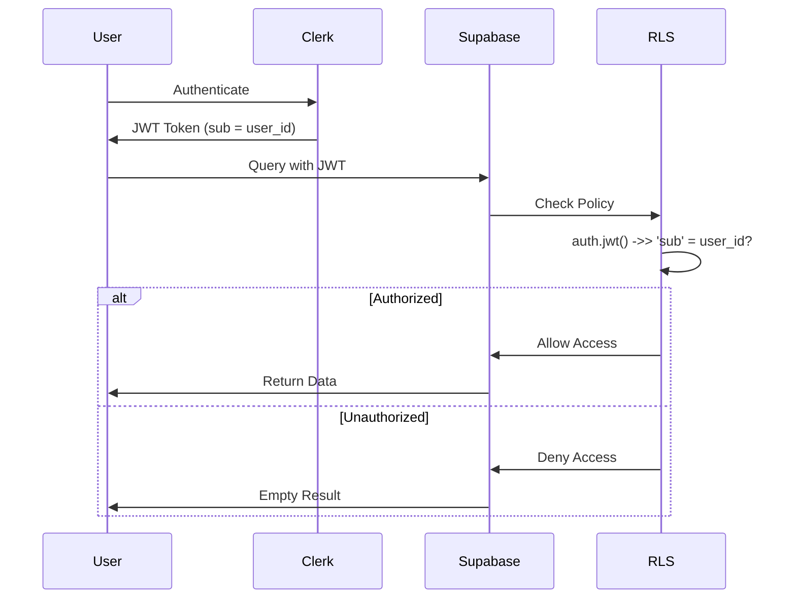
```mermaid
sequenceDiagram
    participant User
    participant Clerk
    participant Supabase
    participant RLS

    User->>Clerk: Authenticate
    Clerk->>User: JWT Token (sub = user_id)
    User->>Supabase: Query with JWT
    Supabase->>RLS: Check Policy
    RLS->>RLS: auth.jwt() ->> 'sub' = user_id?
    alt Authorized
        RLS->>Supabase: Allow Access
        Supabase->>User: Return Data
    else Unauthorized
        RLS->>Supabase: Deny Access
        Supabase->>User: Empty Result
    end
```

### RLS-Policies

```sql
-- Beispiel: invoices Policy
CREATE POLICY "Users can only access own invoices"
ON invoices FOR ALL
USING (user_id = auth.jwt() ->> 'sub');

-- Beispiel: invoice_items Policy (über Parent)
CREATE POLICY "Users access items through invoice ownership"
ON invoice_items FOR ALL
USING (
  invoice_id IN (
    SELECT id FROM invoices
    WHERE user_id = auth.jwt() ->> 'sub'
  )
);
```

---

## 5. Authentifizierung & Sicherheit

### Authentifizierungsfluss

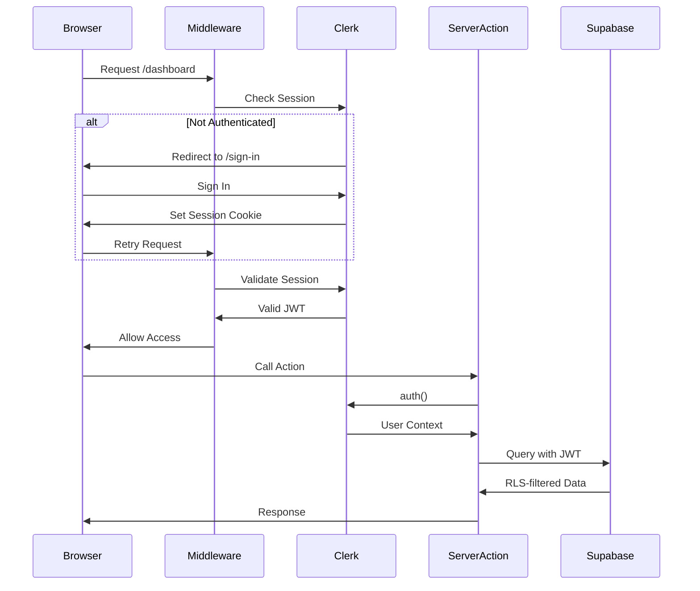
```mermaid
sequenceDiagram
    participant Browser
    participant Middleware
    participant Clerk
    participant ServerAction
    participant Supabase

    Browser->>Middleware: Request /dashboard
    Middleware->>Clerk: Check Session

    alt Not Authenticated
        Clerk->>Browser: Redirect to /sign-in
        Browser->>Clerk: Sign In
        Clerk->>Browser: Set Session Cookie
        Browser->>Middleware: Retry Request
    end

    Middleware->>Clerk: Validate Session
    Clerk->>Middleware: Valid JWT
    Middleware->>Browser: Allow Access

    Browser->>ServerAction: Call Action
    ServerAction->>Clerk: auth()
    Clerk->>ServerAction: User Context
    ServerAction->>Supabase: Query with JWT
    Supabase->>ServerAction: RLS-filtered Data
    ServerAction->>Browser: Response
```

### Sicherheitsebenen

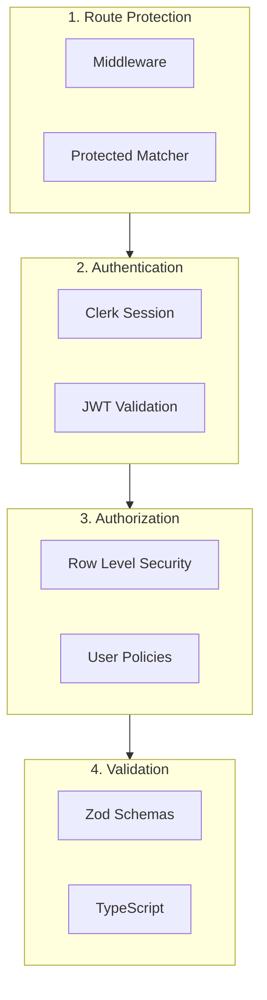
```mermaid
graph TB
    subgraph Layer1["1. Route Protection"]
        MW[Middleware]
        PM[Protected Matcher]
    end

    subgraph Layer2["2. Authentication"]
        CS[Clerk Session]
        JWT[JWT Validation]
    end

    subgraph Layer3["3. Authorization"]
        RLS[Row Level Security]
        UP[User Policies]
    end

    subgraph Layer4["4. Validation"]
        ZOD[Zod Schemas]
        TS[TypeScript]
    end

    Layer1 --> Layer2
    Layer2 --> Layer3
    Layer3 --> Layer4
```

---

## 6. Anwendungsstruktur

### Verzeichnisstruktur

```
src/
├── app/                          # Next.js App Router
│   ├── (auth)/                   # Öffentliche Auth-Routen
│   │   ├── sign-in/
│   │   └── sign-up/
│   ├── (protected)/              # Geschützte Routen
│   │   ├── dashboard/
│   │   │   ├── page.tsx
│   │   │   └── actions.ts
│   │   ├── customers/
│   │   │   ├── page.tsx
│   │   │   └── actions.ts
│   │   ├── invoices/
│   │   │   ├── page.tsx
│   │   │   ├── actions.ts
│   │   │   ├── new/
│   │   │   └── [id]/
│   │   │       ├── page.tsx
│   │   │       ├── actions.ts
│   │   │       └── pdf/route.ts
│   │   └── settings/
│   │       ├── page.tsx
│   │       └── actions.ts
│   ├── page.tsx                  # Landing Page
│   └── layout.tsx                # Root Layout
│
├── components/                   # React Components
│   ├── customers/
│   ├── invoices/
│   ├── layout/
│   └── settings/
│
├── lib/                          # Utilities & Integrationen
│   ├── email/                    # Resend Integration
│   ├── pdf/                      # PDF Templates
│   ├── validations/              # Zod Schemas
│   ├── zugferd/                  # ZUGFeRD/XRechnung
│   ├── supabase.ts               # DB Client
│   └── utils.ts                  # Hilfsfunktionen
│
└── types/                        # TypeScript Typen
    └── database.ts
```

### Server Actions Übersicht

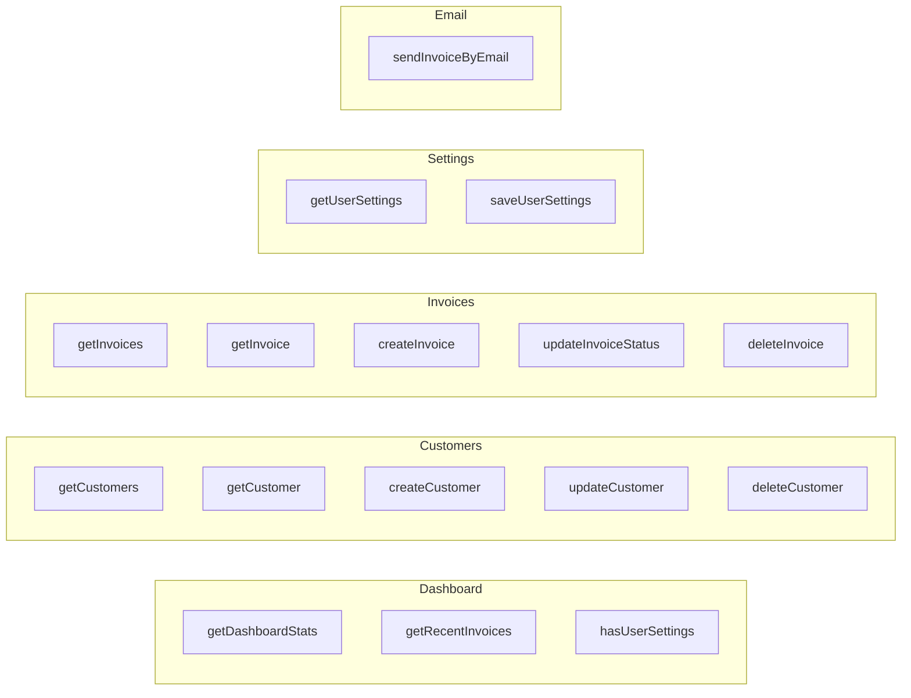
```mermaid
graph LR
    subgraph Dashboard
        D1[getDashboardStats]
        D2[getRecentInvoices]
        D3[hasUserSettings]
    end

    subgraph Customers
        C1[getCustomers]
        C2[getCustomer]
        C3[createCustomer]
        C4[updateCustomer]
        C5[deleteCustomer]
    end

    subgraph Invoices
        I1[getInvoices]
        I2[getInvoice]
        I3[createInvoice]
        I4[updateInvoiceStatus]
        I5[deleteInvoice]
    end

    subgraph Settings
        S1[getUserSettings]
        S2[saveUserSettings]
    end

    subgraph Email
        E1[sendInvoiceByEmail]
    end
```

---

## 7. ZUGFeRD E-Rechnung

### Was ist ZUGFeRD?

ZUGFeRD (Zentraler User Guide des Forums elektronische Rechnung Deutschland) ist ein deutsches Format für elektronische Rechnungen:

- **PDF/A-3**: Archivfähiges PDF-Format
- **Eingebettetes XML**: Maschinenlesbare Rechnungsdaten
- **XRechnung-konform**: Entspricht dem deutschen E-Rechnungsstandard

### ZUGFeRD-Generierungsfluss

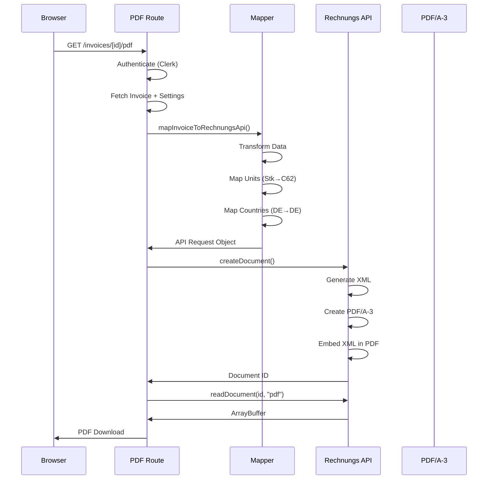
```mermaid
sequenceDiagram
    participant UI as Browser
    participant Route as PDF Route
    participant Map as Mapper
    participant API as Rechnungs API
    participant PDF as PDF/A-3

    UI->>Route: GET /invoices/[id]/pdf
    Route->>Route: Authenticate (Clerk)
    Route->>Route: Fetch Invoice + Settings
    Route->>Map: mapInvoiceToRechnungsApi()
    Map->>Map: Transform Data
    Map->>Map: Map Units (Stk→C62)
    Map->>Map: Map Countries (DE→DE)
    Map->>Route: API Request Object
    Route->>API: createDocument()
    API->>API: Generate XML
    API->>API: Create PDF/A-3
    API->>API: Embed XML in PDF
    API->>Route: Document ID
    Route->>API: readDocument(id, "pdf")
    API->>Route: ArrayBuffer
    Route->>UI: PDF Download
```

### XRechnung-Mapping

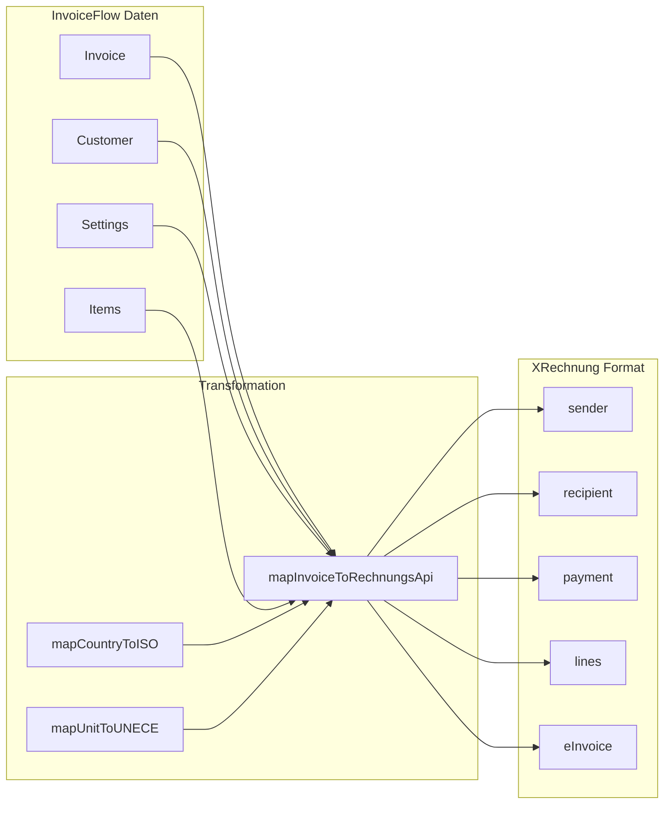
```mermaid
graph LR
    subgraph Input["InvoiceFlow Daten"]
        I1[Invoice]
        I2[Customer]
        I3[Settings]
        I4[Items]
    end

    subgraph Mapping["Transformation"]
        M1[mapInvoiceToRechnungsApi]
        M2[mapCountryToISO]
        M3[mapUnitToUNECE]
    end

    subgraph Output["XRechnung Format"]
        O1[sender]
        O2[recipient]
        O3[payment]
        O4[lines]
        O5[eInvoice]
    end

    I1 --> M1
    I2 --> M1
    I3 --> M1
    I4 --> M1
    M1 --> O1
    M1 --> O2
    M1 --> O3
    M1 --> O4
    M1 --> O5
    M2 --> M1
    M3 --> M1
```

### Pflichtfelder für XRechnung

| Feld | BT-Code | Beschreibung |
|------|---------|--------------|
| Buyer Reference | BT-10 | Käufer-Referenz ("00" wenn N/A) |
| Electronic Address | BT-34/BT-49 | E-Mail mit Schema "EM" |
| Contact Person | BT-41 | Name des Ansprechpartners |
| Delivery Period | BG-14 | Leistungszeitraum |
| Payment Means | BT-81 | Zahlungsart (Code 30 = Bank) |

---

## 8. E-Mail-System

### E-Mail-Versandfluss

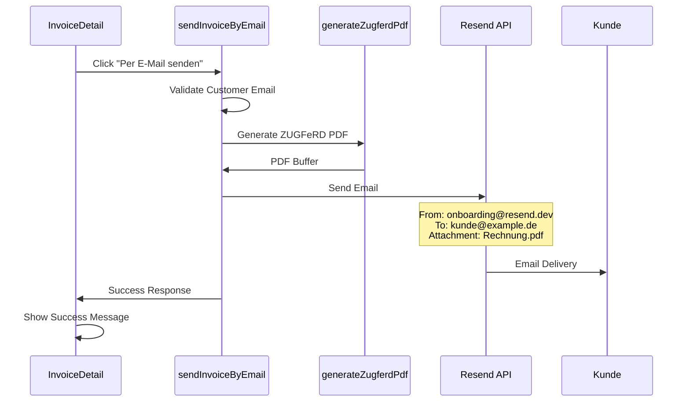
```mermaid
sequenceDiagram
    participant UI as InvoiceDetail
    participant Action as sendInvoiceByEmail
    participant PDF as generateZugferdPdf
    participant Resend as Resend API
    participant Customer as Kunde

    UI->>Action: Click "Per E-Mail senden"
    Action->>Action: Validate Customer Email
    Action->>PDF: Generate ZUGFeRD PDF
    PDF->>Action: PDF Buffer
    Action->>Resend: Send Email
    Note over Resend: From: onboarding@resend.dev<br/>To: kunde@example.de<br/>Attachment: Rechnung.pdf
    Resend->>Customer: Email Delivery
    Action->>UI: Success Response
    UI->>UI: Show Success Message
```

### Resend-Integration

```typescript
// Singleton Pattern für Resend Client
let resendClient: Resend | null = null;

export function getResendClient(): Resend {
  if (!resendClient) {
    resendClient = new Resend(process.env.RESEND_API_KEY);
  }
  return resendClient;
}
```

---

## 9. Datenfluss-Diagramme

### Rechnungserstellung

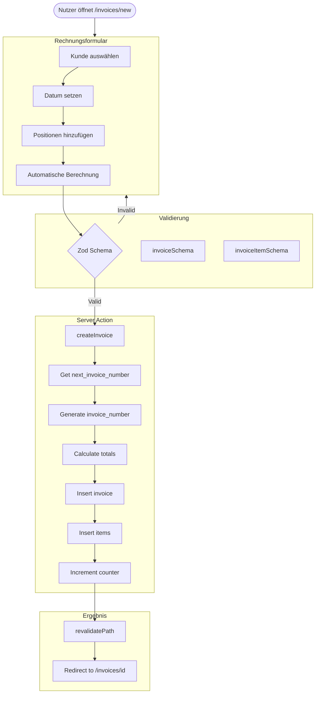
```mermaid
flowchart TB
    Start([Nutzer öffnet /invoices/new])

    subgraph Form["Rechnungsformular"]
        F1[Kunde auswählen]
        F2[Datum setzen]
        F3[Positionen hinzufügen]
        F4[Automatische Berechnung]
    end

    subgraph Validation["Validierung"]
        V1{Zod Schema}
        V2[invoiceSchema]
        V3[invoiceItemSchema]
    end

    subgraph Server["Server Action"]
        S1[createInvoice]
        S2[Get next_invoice_number]
        S3[Generate invoice_number]
        S4[Calculate totals]
        S5[Insert invoice]
        S6[Insert items]
        S7[Increment counter]
    end

    subgraph Result["Ergebnis"]
        R1[revalidatePath]
        R2[Redirect to /invoices/id]
    end

    Start --> Form
    F1 --> F2 --> F3 --> F4
    F4 --> V1
    V1 -->|Valid| S1
    V1 -->|Invalid| Form
    S1 --> S2 --> S3 --> S4 --> S5 --> S6 --> S7
    S7 --> R1 --> R2
```

### Statusänderung

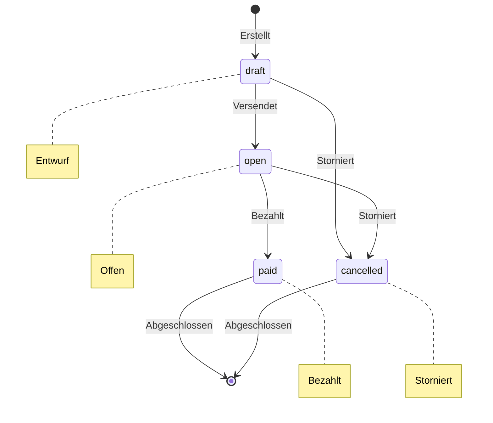
```mermaid
stateDiagram-v2
    [*] --> draft: Erstellt
    draft --> open: Versendet
    draft --> cancelled: Storniert
    open --> paid: Bezahlt
    open --> cancelled: Storniert
    paid --> [*]: Abgeschlossen
    cancelled --> [*]: Abgeschlossen

    note right of draft: Entwurf
    note right of open: Offen
    note right of paid: Bezahlt
    note right of cancelled: Storniert
```

---

## 10. Komponentenarchitektur

### Komponentenhierarchie

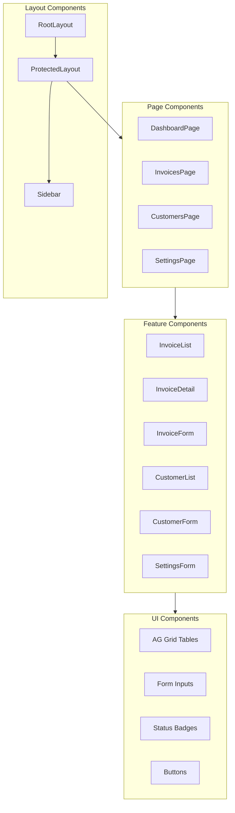
```mermaid
graph TB
    subgraph Layout["Layout Components"]
        L1[RootLayout]
        L2[ProtectedLayout]
        L3[Sidebar]
    end

    subgraph Pages["Page Components"]
        P1[DashboardPage]
        P2[InvoicesPage]
        P3[CustomersPage]
        P4[SettingsPage]
    end

    subgraph Features["Feature Components"]
        F1[InvoiceList]
        F2[InvoiceDetail]
        F3[InvoiceForm]
        F4[CustomerList]
        F5[CustomerForm]
        F6[SettingsForm]
    end

    subgraph UI["UI Components"]
        U1[AG Grid Tables]
        U2[Form Inputs]
        U3[Status Badges]
        U4[Buttons]
    end

    L1 --> L2
    L2 --> L3
    L2 --> Pages
    Pages --> Features
    Features --> UI
```

### Server vs. Client Components

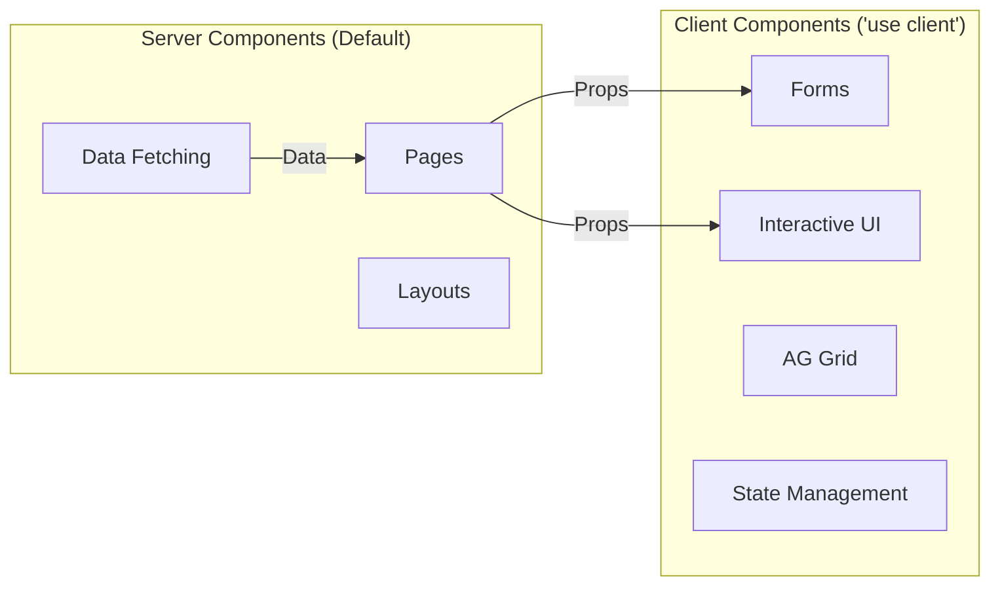
```mermaid
graph LR
    subgraph Server["Server Components (Default)"]
        S1[Pages]
        S2[Layouts]
        S3[Data Fetching]
    end

    subgraph Client["Client Components ('use client')"]
        C1[Forms]
        C2[Interactive UI]
        C3[AG Grid]
        C4[State Management]
    end

    S1 -->|Props| C1
    S1 -->|Props| C2
    S3 -->|Data| S1
```

---

## 11. Validierung & Fehlerbehandlung

### Validierungsschichten

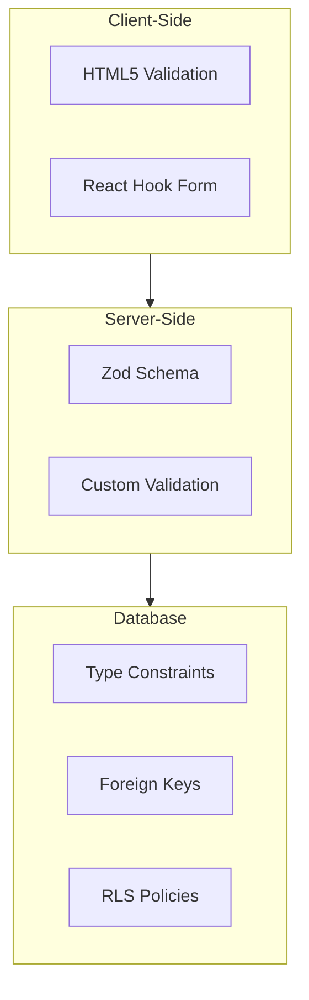
```mermaid
graph TB
    subgraph L1["Client-Side"]
        C1[HTML5 Validation]
        C2[React Hook Form]
    end

    subgraph L2["Server-Side"]
        S1[Zod Schema]
        S2[Custom Validation]
    end

    subgraph L3["Database"]
        D1[Type Constraints]
        D2[Foreign Keys]
        D3[RLS Policies]
    end

    L1 --> L2 --> L3
```

### Zod-Validierungsbeispiel

```typescript
// Deutsche Fehlermeldungen
const invoiceItemSchema = z.object({
  description: z
    .string()
    .min(1, "Beschreibung ist erforderlich")
    .max(500, "Maximal 500 Zeichen"),
  quantity: z
    .number()
    .min(0.01, "Mindestens 0,01")
    .max(999999, "Maximal 999.999"),
  unit_price: z
    .number()
    .min(0, "Darf nicht negativ sein")
    .max(9999999.99, "Maximal 9.999.999,99 €"),
  vat_rate: z
    .number()
    .min(0, "Mindestens 0%")
    .max(100, "Maximal 100%")
    .default(19),
});
```

---

## 12. Testing-Strategie

### Test-Pyramide

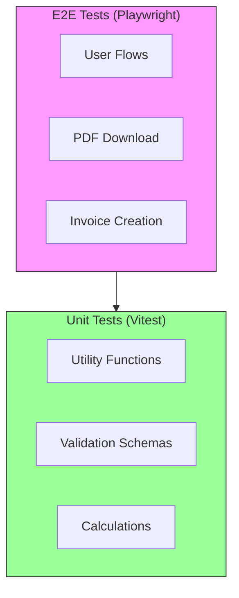
```mermaid
graph TB
    subgraph E2E["E2E Tests (Playwright)"]
        E1[User Flows]
        E2[PDF Download]
        E3[Invoice Creation]
    end

    subgraph Unit["Unit Tests (Vitest)"]
        U1[Utility Functions]
        U2[Validation Schemas]
        U3[Calculations]
    end

    E2E --> Unit

    style E2E fill:#f9f,stroke:#333
    style Unit fill:#9f9,stroke:#333
```

### Testabdeckung

| Bereich | Testtyp | Anzahl Tests |
|---------|---------|--------------|
| Berechnungen | Unit | 10 |
| Formatierung | Unit | 7 |
| Validierung | Unit | 40+ |
| Invoice Flows | E2E | 5 |
| Customer CRUD | E2E | 4 |
| PDF Download | E2E | 2 |

### E2E-Test-Setup

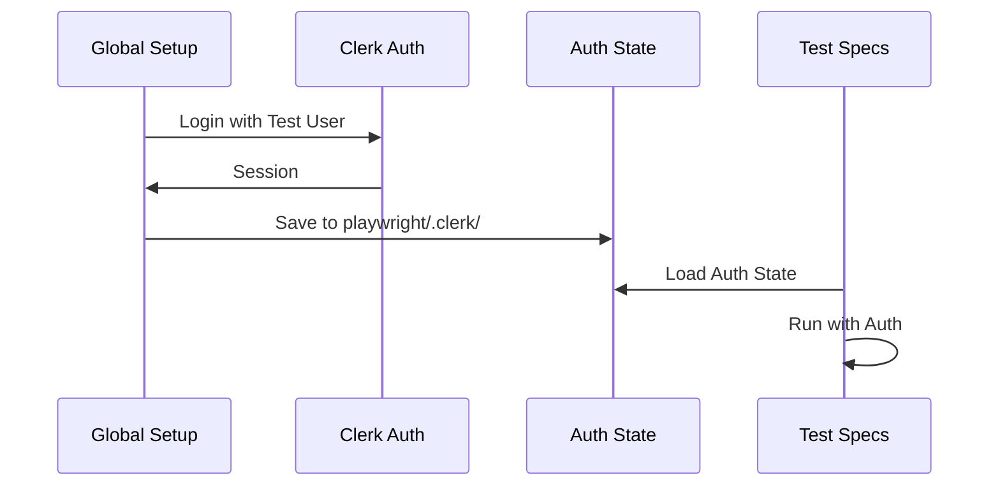
```mermaid
sequenceDiagram
    participant Setup as Global Setup
    participant Clerk as Clerk Auth
    participant State as Auth State
    participant Tests as Test Specs

    Setup->>Clerk: Login with Test User
    Clerk->>Setup: Session
    Setup->>State: Save to playwright/.clerk/
    Tests->>State: Load Auth State
    Tests->>Tests: Run with Auth
```

---

## 13. Externe Services

### Service-Übersicht

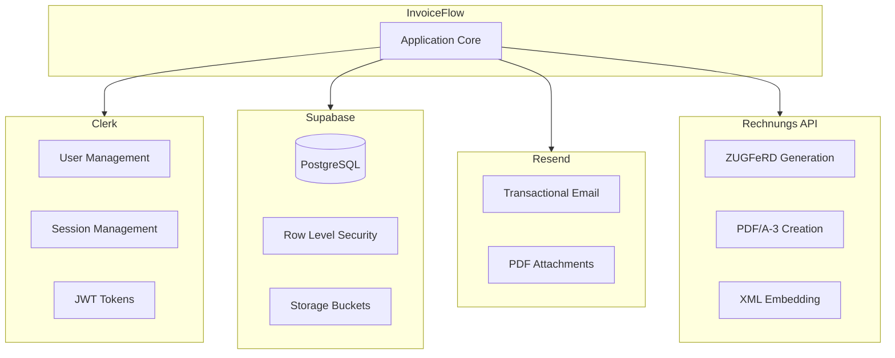
```mermaid
graph TB
    subgraph App["InvoiceFlow"]
        Core[Application Core]
    end

    subgraph Auth["Clerk"]
        A1[User Management]
        A2[Session Management]
        A3[JWT Tokens]
    end

    subgraph DB["Supabase"]
        D1[(PostgreSQL)]
        D2[Row Level Security]
        D3[Storage Buckets]
    end

    subgraph Email["Resend"]
        E1[Transactional Email]
        E2[PDF Attachments]
    end

    subgraph Invoice["Rechnungs API"]
        I1[ZUGFeRD Generation]
        I2[PDF/A-3 Creation]
        I3[XML Embedding]
    end

    Core --> Auth
    Core --> DB
    Core --> Email
    Core --> Invoice
```

### API-Konfiguration

| Service | Umgebungsvariable | Beschreibung |
|---------|-------------------|--------------|
| Clerk | `CLERK_SECRET_KEY` | Server-seitiger API-Key |
| Clerk | `NEXT_PUBLIC_CLERK_PUBLISHABLE_KEY` | Client-seitiger Key |
| Supabase | `NEXT_PUBLIC_SUPABASE_URL` | Projekt-URL |
| Supabase | `NEXT_PUBLIC_SUPABASE_ANON_KEY` | Anonymous Key |
| Resend | `RESEND_API_KEY` | API-Key für E-Mail |
| Rechnungs API | `RECHNUNGS_API_KEY` | API-Key für ZUGFeRD |

---

## 14. Deployment

### Deployment-Architektur

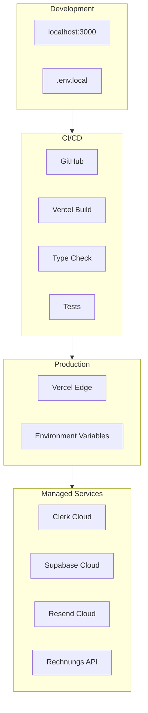
```mermaid
graph TB
    subgraph Dev["Development"]
        D1[localhost:3000]
        D2[.env.local]
    end

    subgraph CI["CI/CD"]
        C1[GitHub]
        C2[Vercel Build]
        C3[Type Check]
        C4[Tests]
    end

    subgraph Prod["Production"]
        P1[Vercel Edge]
        P2[Environment Variables]
    end

    subgraph Services["Managed Services"]
        S1[Clerk Cloud]
        S2[Supabase Cloud]
        S3[Resend Cloud]
        S4[Rechnungs API]
    end

    Dev --> CI
    CI --> Prod
    Prod --> Services
```

### Deployment-Checkliste

- [ ] Umgebungsvariablen in Vercel konfigurieren
- [ ] Supabase Production-Keys verwenden
- [ ] Clerk Production-Instance aktivieren
- [ ] Resend Domain verifizieren
- [ ] Rechnungs API Production-Key (`prod_*`) verwenden

---

## Anhang

### A. Berechnungsformeln

```
Nettobetrag = Menge × Einzelpreis
MwSt-Betrag = Nettobetrag × (MwSt-Satz / 100)
Bruttobetrag = Nettobetrag + MwSt-Betrag

Rechnungssumme (netto) = Σ Nettobetrag aller Positionen
Rechnungssumme (MwSt) = Σ MwSt-Betrag aller Positionen
Rechnungssumme (brutto) = Σ Bruttobetrag aller Positionen
```

### B. UNECE-Einheitencodes

| Einheit | Code | Beschreibung |
|---------|------|--------------|
| Stück | C62 | One (Piece) |
| Stunde | HUR | Hour |
| Tag | DAY | Day |
| Monat | MON | Month |
| Kilogramm | KGM | Kilogram |
| Meter | MTR | Metre |
| Liter | LTR | Litre |
| Quadratmeter | MTK | Square Metre |

### C. ISO-Ländercodes

| Land | Code |
|------|------|
| Deutschland | DE |
| Österreich | AT |
| Schweiz | CH |
| Frankreich | FR |
| Niederlande | NL |
