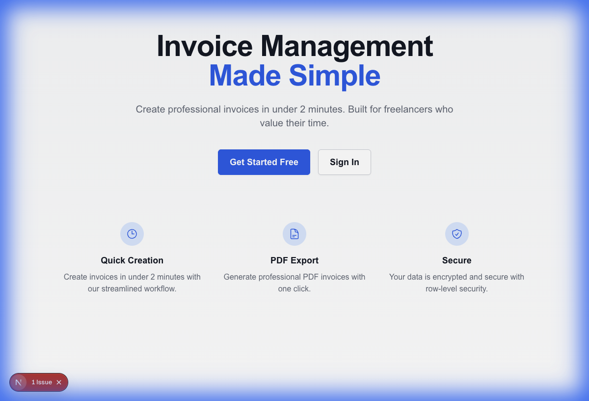
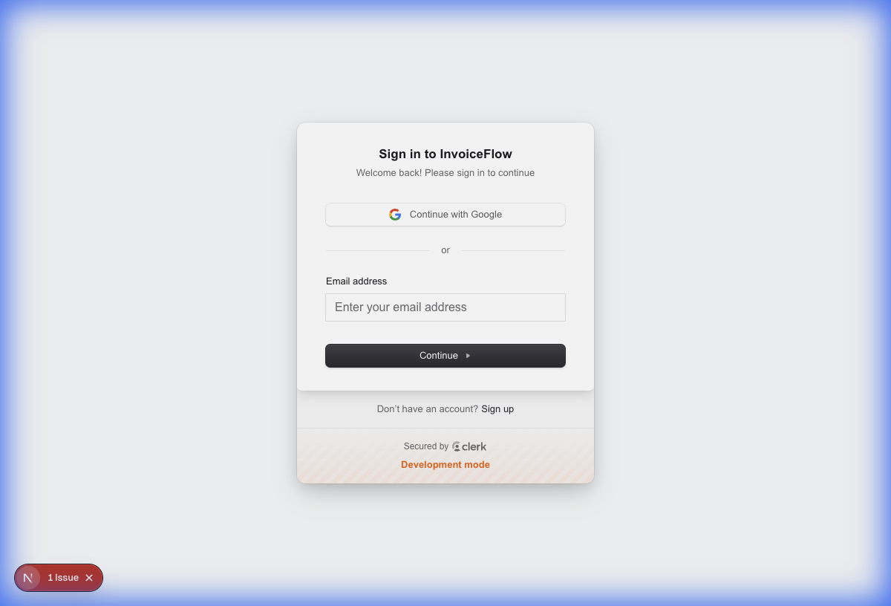
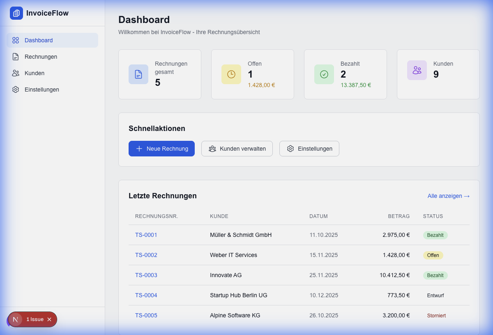
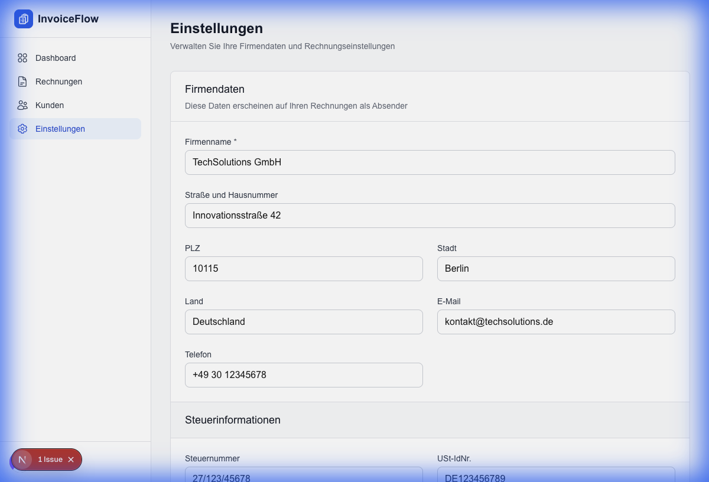
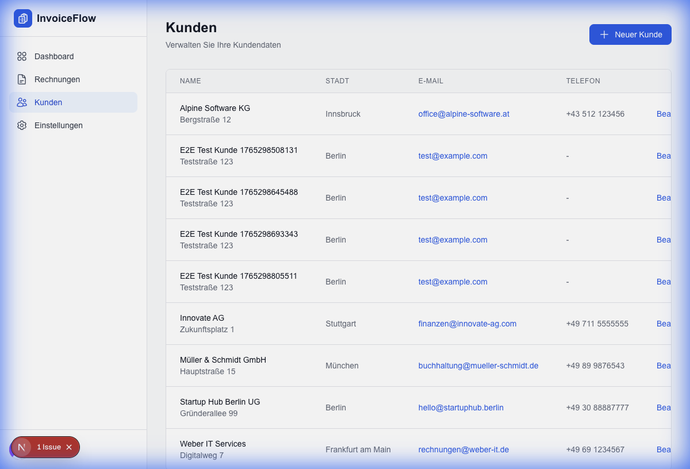
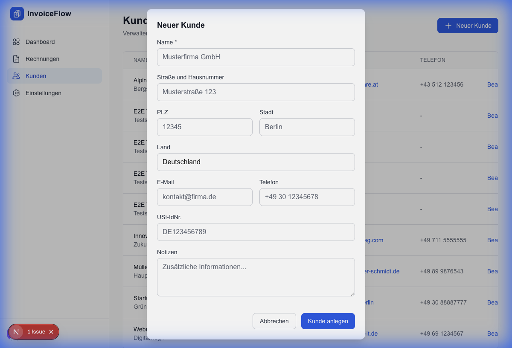
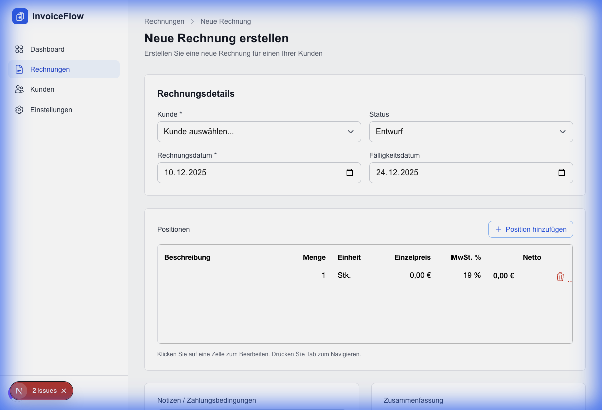
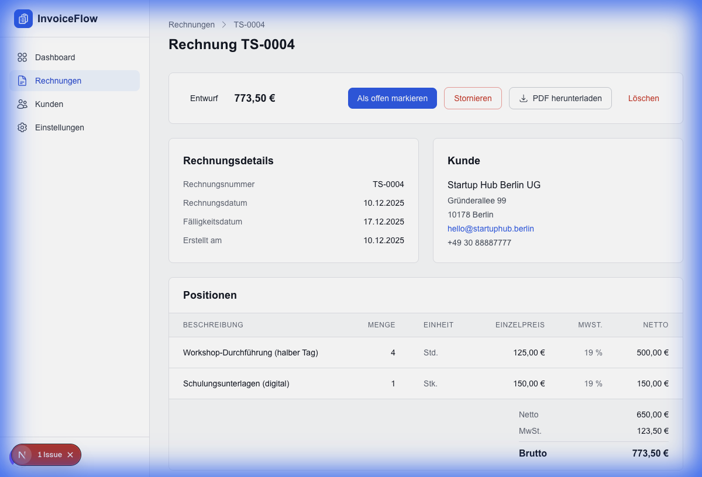

# InvoiceFlow - Final Presentation
**E-Business und Entrepreneurship - Abschlusspräsentation**  
**Yejay Demirkan - 927077**  
**Dauer: ca. 10 Minuten**

---

## 1. Anwendungszweck (~0,5 Min)

### Was ist InvoiceFlow?

Eine moderne Rechnungsverwaltung für **Freiberufler** und kleine Unternehmen in Deutschland.

**Kernproblem:**
- Freelancer verbringen 15-30 Minuten pro Rechnung
- Existierende Tools sind komplex und teuer
- Einfache Lösung ohne Feature Bloat gesucht

**Unsere Lösung:**
- Rechnungserstellung in unter 2 Minuten
- Setup in unter 2 Minuten
- Kostenlose Basisversion



---

## 2. Anforderungen (~1-2 Min)

### User Story: "Max der Freelancer"

> *Max ist Webentwickler und muss nach Abschluss eines Projekts schnell eine Rechnung erstellen.*

**Der Workflow:**

1. **Anmeldung** - Max meldet sich mit Google OAuth an (Clerk)
2. **Ersteinrichtung** - Er gibt einmalig seine Firmendaten ein
3. **Kunde anlegen** - Max legt seinen Kunden "TechStartup GmbH" an
4. **Rechnung erstellen** - Er wählt den Kunden, fügt Positionen hinzu
5. **PDF generieren** - Mit einem Klick wird ein professionelles PDF erstellt
6. **Versenden & Tracken** - Max lädt das PDF herunter und markiert die Rechnung später als "bezahlt"

### Muss-Anforderungen (Must-Have)

| Anforderung | Status |
|-------------|--------|
| Benutzerauthentifizierung (E-Mail/OAuth) | ✓ Umgesetzt |
| Firmendaten-Einstellungen | ✓ Umgesetzt |
| Kundenverwaltung (CRUD) | ✓ Umgesetzt |
| Rechnungserstellung mit Positionen | ✓ Umgesetzt |
| Automatische Berechnung (Netto/MwSt./Brutto) | ✓ Umgesetzt |
| PDF-Generierung nach deutschen Standards | ✓ Umgesetzt |
| Status-Tracking (Entwurf → Offen → Bezahlt) | ✓ Umgesetzt |

### Nice-to-Have Anforderungen

| Anforderung | Status |
|-------------|--------|
| E-Mail-Versand von Rechnungen | Offen |
| Mehrere Rechnungstemplates | Offen |
| Recurring Invoices | Offen |
| Multi-Tenant / Team-Funktionalität | Offen |
| Tier-basierte Preisgestaltung (Clerk) | Vorbereitet |

---

## 3. Architektur und Umsetzung (~4-5 Min)

### Client-Server Architektur

```
┌─────────────────────────────────────────────────────────────────┐
│                         CLIENT (Browser)                         │
├─────────────────────────────────────────────────────────────────┤
│  Next.js 16 (React 19)                                          │
│  ├── React Server Components (Standard)                         │
│  ├── Client Components ("use client" bei Interaktivität)        │
│  ├── Tailwind CSS + Preline UI (Styling)                        │
│  └── AG Grid (Tabellen für Rechnungspositionen)                 │
└─────────────────────────────────────────────────────────────────┘
                              │
                              ▼
┌─────────────────────────────────────────────────────────────────┐
│                         SERVER (Next.js)                         │
├─────────────────────────────────────────────────────────────────┤
│  Server Actions ("use server")                                  │
│  ├── Dashboard: getDashboardStats()                             │
│  ├── Customers: CRUD Operations                                 │
│  ├── Invoices: getInvoices(), createInvoice(), updateStatus()   │
│  ├── Settings: get/saveUserSettings()                           │
│  └── PDF: generateInvoicePdf() via @react-pdf/renderer          │
└─────────────────────────────────────────────────────────────────┘
                              │
                              ▼
┌─────────────────────────────────────────────────────────────────┐
│                    EXTERNE DIENSTE                               │
├──────────────────────────┬──────────────────────────────────────┤
│       Clerk              │           Supabase                    │
│  ├── Authentifizierung   │  ├── PostgreSQL Datenbank            │
│  ├── Session Management  │  ├── Row-Level Security (RLS)        │
│  ├── OAuth Provider      │  └── Storage (PDF Bucket)            │
│  └── JWT für Supabase    │                                      │
└──────────────────────────┴──────────────────────────────────────┘
```

### Datenmodell

```
┌─────────────────┐
│     Users       │
│  (Clerk-managed)│
│─────────────────│
│  user_id (PK)   │
└────────┬────────┘
         │
         │ 1:1 (Komposition)
         ▼
┌─────────────────┐       1:n (Komposition)      ┌─────────────────┐
│  UserSettings   │◄──────────────────────────────│    Customers    │
│─────────────────│                               │─────────────────│
│  id (PK)        │                               │  id (PK)        │
│  user_id (FK)   │                               │  user_id (FK)   │
│  company_name   │                               │  name           │
│  street         │                               │  email, vat_id  │
│  tax_number     │                               └────────┬────────┘
│  iban           │                                        │
└─────────────────┘                                        │ n:1 (Aggregation)
         ┌─────────────────────────────────────────────────┘
         │
         ▼
┌─────────────────┐       1:n (Komposition)      ┌─────────────────┐
│    Invoices     │─────────────────────────────►│  InvoiceItems   │
│─────────────────│                               │─────────────────│
│  id, user_id    │                               │  id, invoice_id │
│  customer_id    │                               │  description    │
│  invoice_number │                               │  quantity, unit │
│  status, dates  │                               │  unit_price     │
│  totals         │                               │  vat_rate       │
└─────────────────┘                               └─────────────────┘
```

**Beziehungstypen:**
- **Users → UserSettings**: Komposition (1:1)
- **Users → Customers**: Komposition (1:n) - Kunden gehören zum User
- **Customers → Invoices**: Aggregation (n:1) - Kunde kann in mehreren Rechnungen vorkommen
- **Invoices → InvoiceItems**: Komposition (1:n)

### Sicherheitskonzept

| Ebene | Technologie | Funktion |
|-------|-------------|----------|
| **Authentifizierung** | Clerk | Email/OAuth Login, Session Management |
| **Autorisierung** | Clerk JWT + Supabase | JWT-Token für API-Zugriff |
| **Input Validation** | Zod Schemas | Server-seitige Validierung aller Eingaben |
| **Row-Level Security** | Supabase RLS | `user_id = auth.uid()` auf allen Tabellen |

```sql
CREATE POLICY "Users can only access own data"
ON invoices FOR ALL
USING (user_id = auth.uid());
```

---

## 4. Schwerpunktthema: Clerk + Supabase Integration (~3-4 Min)

### Warum dieses Thema?

Die Integration von **Clerk** (Authentifizierung) mit **Supabase** (Datenbank) ist das technische Herzstück der Anwendung.

### Was ist Clerk?

- Modernes Authentication-as-a-Service
- Out-of-the-box UI-Komponenten (Sign-In, Sign-Up, User Profile)
- Multi-Provider OAuth (Google, GitHub, etc.)
- Session Management mit JWTs



### Was ist Supabase?

- Open-Source Alternative zu Firebase
- PostgreSQL Datenbank mit REST API
- Row-Level Security (RLS) für Datenisolation
- Storage für Dateien (PDF-Bucket)

### Der Authentifizierungsfluss

```
┌──────────┐     1. Login      ┌──────────┐
│  Browser │──────────────────►│  Clerk   │
└────┬─────┘                   └────┬─────┘
     │                              │
     │◄─────── 2. JWT Token ────────┘
     │
     │      3. Request + JWT
     ▼
┌──────────┐                   ┌──────────┐
│ Next.js  │──────────────────►│ Supabase │
│  Server  │   4. JWT + Query  │    DB    │
└──────────┘                   └────┬─────┘
                                    │
                    5. RLS prüft: user_id = jwt.sub
                                    │
                                    ▼
                            Nur eigene Daten!
```

### Code-Beispiel: Supabase Client

```typescript
// src/lib/supabase.ts
import { auth } from "@clerk/nextjs/server";
import { createClient } from "@supabase/supabase-js";

export async function createServerSupabaseClient() {
  const { getToken } = await auth();
  const supabaseToken = await getToken({ template: "supabase" });

  return createClient(
    process.env.NEXT_PUBLIC_SUPABASE_URL!,
    process.env.NEXT_PUBLIC_SUPABASE_ANON_KEY!,
    {
      global: {
        headers: {
          Authorization: `Bearer ${supabaseToken}`,
        },
      },
    }
  );
}
```

### Lessons Learned

| Thema | Erkenntnis |
|-------|------------|
| **JWT Template** | Clerk muss mit "supabase" Template konfiguriert werden |
| **RLS ist mächtig** | Einmal konfiguriert, automatische Datenisolation |
| **Server Components** | Supabase-Calls nur serverseitig für Sicherheit |
| **Testing** | Clerk bietet Test-Mode mit `+clerk_test` E-Mails |
| **Type Safety** | Supabase generiert TypeScript-Types aus Schema |

**Herausforderungen:**
- Initiale Konfiguration erfordert Verständnis beider Systeme
- JWT-Token muss bei jedem Server-Request neu geholt werden
- Debug schwieriger bei RLS-Fehlern (Silent Failures)

---

## 5. Aktueller Entwicklungsstand (~0,5-1 Min)

### Vollständig Umgesetzt

- ✓ Authentifizierung (Clerk)
- ✓ Dashboard mit Statistiken
- ✓ Kundenverwaltung (CRUD)
- ✓ Rechnungserstellung mit AG Grid
- ✓ Rechnungsliste mit Statusfilter
- ✓ PDF-Generierung (deutsche Standards)
- ✓ Einstellungen (Firmendaten, Steuern, Bank)
- ✓ Row-Level Security

### Testing

- ✓ 89 Unit Tests (Vitest)
- ✓ 23 E2E Tests (Playwright)
- ✓ CI/CD Pipeline (GitHub Actions)

### Offen (Nice-to-Have)

- ○ E-Mail-Versand
- ○ Premium Templates
- ○ Tier-System (Clerk Billing)

---

## Screenshots der Anwendung

### Dashboard


### Einstellungen


### Kundenverwaltung


### Neuer Kunde Modal


### Rechnungsliste


### Neue Rechnung erstellen (AG Grid)


### Rechnungsdetails


---

## Video Walkthrough

Die folgende Animation zeigt einen vollständigen Durchlauf der Anwendung:


---

## Technologie-Referenzen

| Technologie | Version | Verwendung |
|-------------|---------|------------|
| Next.js | 16 | Full-Stack Framework |
| React | 19 | UI Library |
| TypeScript | 5.x | Type Safety |
| Tailwind CSS | 4.x | Styling |
| Clerk | Latest | Authentication |
| Supabase | Latest | Database + Storage |
| AG Grid | Community | Data Tables |
| @react-pdf/renderer | Latest | PDF Generation |
| Zod | 4.x | Validation |
| Vitest | Latest | Unit Testing |
| Playwright | Latest | E2E Testing |

---

## Deployment

| Service | Anbieter | Funktion |
|---------|----------|----------|
| **Frontend + API** | Vercel | Next.js Hosting, Edge Functions, CI/CD |
| **Datenbank** | Supabase | PostgreSQL, Storage, RLS |
| **Authentifizierung** | Clerk | User Management, OAuth |

**Kosten (Free Tier):** 0€/Monat für MVP-Phase
